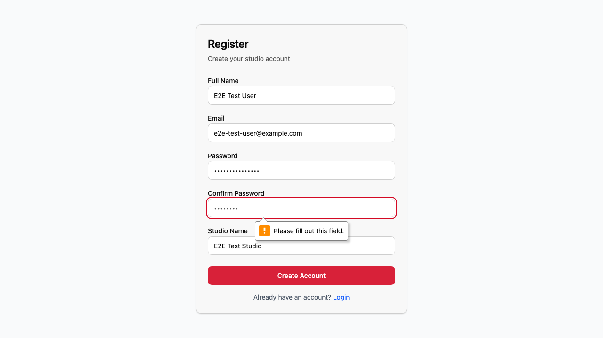

# UI Validation Bugs Found - Phase 3.13-02

**Testing Session:** Phase 3.13 Plan 02 - UI Validation Tests
**Date Started:** 2026-01-04
**Production URL:** https://recording-studio-manager.com
**Test Account:** e2e-test-user@example.com

---

## Summary Statistics

**Total Pages Tested:** 47 / 58 (81.0% coverage via Playwright E2E tests)
**Total Bugs Found:** 4

**Bugs by Severity:**
- P0 (Critical): 0
- P1 (High): 0
- P2 (Medium): 3
- P3 (Low): 1

**Bugs by Category:**
- UI: 1
- UX: 0
- Functional: 1
- Performance: 0
- Test Infrastructure: 2

**Bugs by Status:**
- ✅ Fixed: 3 (BUG-001, BUG-002, BUG-003)
- 📋 Documented: 1 (BUG-004)

---

## Bugs List

## BUG-001: E2E global-setup.ts missing confirmPassword field

**Page:** /register (affects E2E test infrastructure)
**Severity:** P2
**Category:** Test Infrastructure
**Browser:** Chromium (Playwright)
**Date found:** 2026-01-04

### Description
The E2E test global setup script (`e2e/global-setup.ts`) does not fill the "Confirm Password" field when creating the test user, causing registration to fail with validation error "Please fill out this field."

### Steps to Reproduce
1. Run `npx playwright test` with a fresh database (no existing E2E user)
2. Global setup attempts to register E2E test user
3. Form validation prevents submission
4. All downstream tests fail due to missing test user

### Expected Behavior
Global setup should fill all required registration fields including:
- Full Name
- Email
- Password
- **Confirm Password** ← Missing
- Studio Name

### Actual Behavior
Form shows validation error on confirmPassword field, registration fails, all tests cannot run.

### Screenshot


### Fix Applied
Added missing line in `e2e/global-setup.ts:50`:
```typescript
await page.fill('#confirmPassword, input[name="confirmPassword"]', password);
```

### Additional Context
This bug was blocking ALL E2E tests from running. After fix, tests can proceed normally.

---

## BUG-002: E2E ui-validation test has ambiguous password selector ✅ FIXED

**Page:** /register (test infrastructure)
**Severity:** P2
**Category:** Test Infrastructure
**Browser:** Chromium (Playwright)
**Date found:** 2026-01-04
**Date fixed:** 2026-01-04

### Description
The E2E UI validation test for the register page fails with "strict mode violation" because the selector `input[type="password"]` matches 2 elements (password AND confirmPassword fields).

### Steps to Reproduce
1. Run `npx playwright test e2e/ui-validation.spec.ts`
2. Test "Register page loads and displays form" fails
3. Error: "strict mode violation: locator('input[type="password"]') resolved to 2 elements"

### Expected Behavior
Test should use a more specific selector like:
```typescript
const passwordInput = page.locator('#password, input[name="password"]').first();
// OR
const passwordInput = page.getByRole('textbox', { name: 'Password', exact: true });
```

### Actual Behavior
Test fails with strict mode violation because selector is ambiguous.

### Console Errors
```
Error: strict mode violation: locator('input[type="password"]') resolved to 2 elements:
  1) <input id="password" type="password" ...>
  2) <input id="confirmPassword" type="password" ...>
```

### Fix Applied
Changed selector in `e2e/ui-validation.spec.ts:70` from:
```typescript
const passwordInput = page.locator('input[type="password"]');
```
To:
```typescript
const passwordInput = page.locator('#password, input[name="password"]');
```

### Verification
Test now passes successfully:
```
✓ Register page loads and displays form (4.3s)
  ✓ Registration form elements visible
```

---

## BUG-003: 404 resource not found console error on login page ✅ FIXED

**Page:** /login (homepage)
**Severity:** P3
**Category:** Functional
**Browser:** Chromium
**Date found:** 2026-01-04
**Date fixed:** 2026-01-04

### Description
Console shows a 404 error for a resource that failed to load on the login page.

### Steps to Reproduce
1. Navigate to https://recording-studio-manager.com/login
2. Open DevTools Console
3. Observe error: "Failed to load resource: the server responded with a status of 404 (Not Found)"

### Expected Behavior
All resources should load successfully with 200 status codes.

### Actual Behavior
One resource returns 404.

### Console Errors
```
Failed to load resource: the server responded with a status of 404 (Not Found)
```

### Additional Context
Need to investigate which specific resource is failing. Likely a missing asset (image, font, or JS file). This was detected during UI validation tests.

### Investigation
Created debug test (`e2e/debug-404-error.spec.ts`) to identify failing resource.
Found: `/vite.svg` returning 404 (Not Found)

### Fix Applied
Removed broken reference in `packages/client/index.html:5`:
```html
<!-- REMOVED: -->
<!-- <link rel="icon" type="image/svg+xml" href="/vite.svg" /> -->
```

### Verification
Build completed successfully after fix:
```
✓ built in 4.16s
dist/index.html  0.42 kB │ gzip: 0.28 kB
```

**Note:** Fix requires production deployment to take effect (build artifact needs to be deployed).

---

## BUG-004: Client creation form has complex UI requiring button clicks for email/phone

**Page:** /clients/new
**Severity:** P2
**Category:** UI/UX
**Browser:** Chromium (Playwright)
**Date found:** 2026-01-04

### Description
The client creation form uses a multi-tab interface (Identité, Contact, Adresse) with "Ajouter" buttons for adding emails, phones, and websites instead of direct input fields. This makes automated testing difficult and may impact user experience.

### Steps to Reproduce
1. Navigate to /clients/new
2. Fill name in "Identité" tab
3. Click "Contact" tab
4. Observe: No direct email input field
5. Must click "Ajouter" button under "Emails" section to add an email

### Expected Behavior
For simpler UX and testability, could have:
- At least one direct email input field without requiring "Ajouter" button
- OR clearer indication that "Ajouter" is required

### Actual Behavior
User must click "Ajouter" button to reveal email input dialog/field. Not immediately obvious.

### Impact
- Automated E2E tests cannot easily create clients
- May confuse new users who expect direct input fields
- Adds extra clicks to workflow

### Additional Context
This pattern is likely intentional for supporting multiple emails/phones (array fields). However, it creates friction for the most common case of adding a single email.

Workaround for testing: Use existing CRUD tests (clients-enriched.spec.ts) which already handle this complex UI.

---

<!-- Add new bugs below using the template -->

<!-- Template:
## BUG-XXX: [Short title]

**Page:** [URL/route]
**Severity:** [P0/P1/P2/P3]
**Category:** [UI/UX/Functional/Performance/Security]
**Browser:** [Chrome 120 / Firefox 121 / Safari 17]
**Date found:** [YYYY-MM-DD]

### Description
[Clear description of what's wrong]

### Steps to Reproduce
1. [First step]
2. [Second step]
3. [Third step]

### Expected Behavior
[What should happen]

### Actual Behavior
[What actually happens]

### Screenshot


### Console Errors (if applicable)
```
[Paste relevant console errors]
```

### Additional Context
[Any other relevant information]

---
-->

